## Nama: Patria Anggara Susilo Putra
## Kelas: TI 3A
## NIM: 2141720058

---

### Praktikum Satu Langkah 4

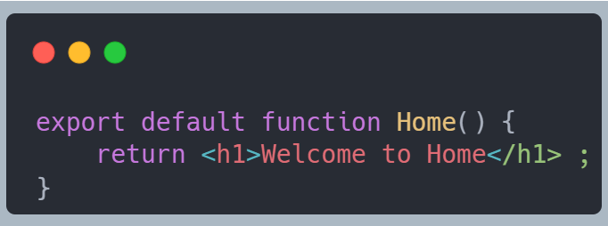

### Praktikum Satu Langkah 7

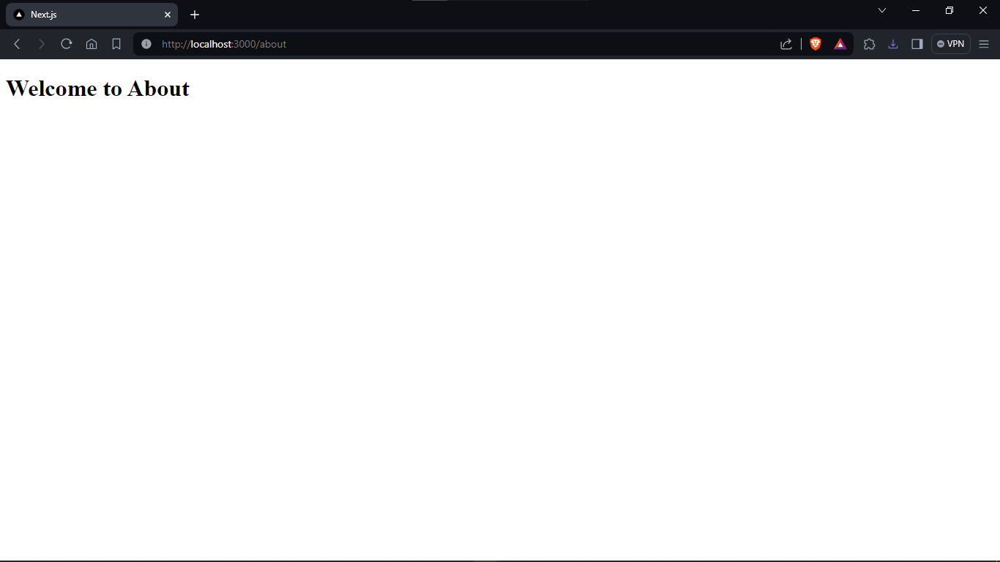

### Praktikum Satu: Todo
Buatlah halaman /profile yang menampilkan isi biodata anda dengan menggunakan routing di NextJS.

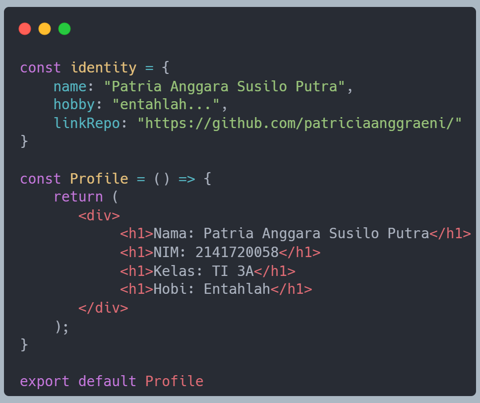

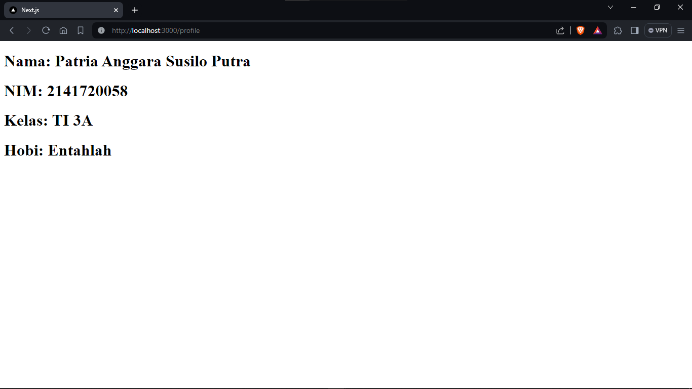

### Praktikum 2 Langkah 2

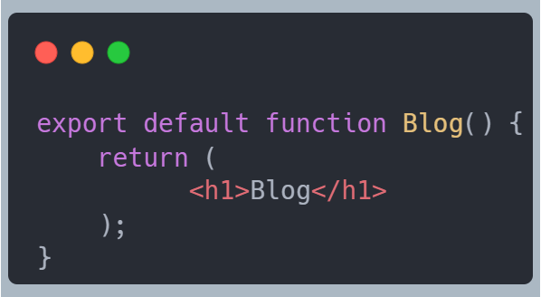

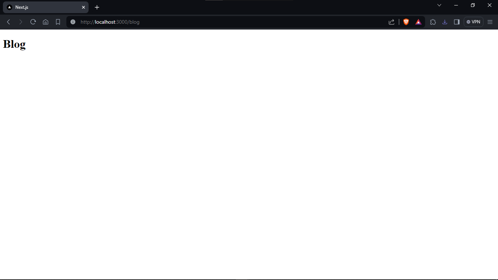

### Praktikum 2 Langkah 3

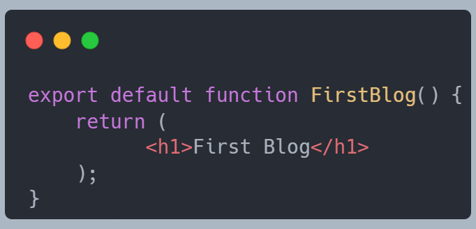

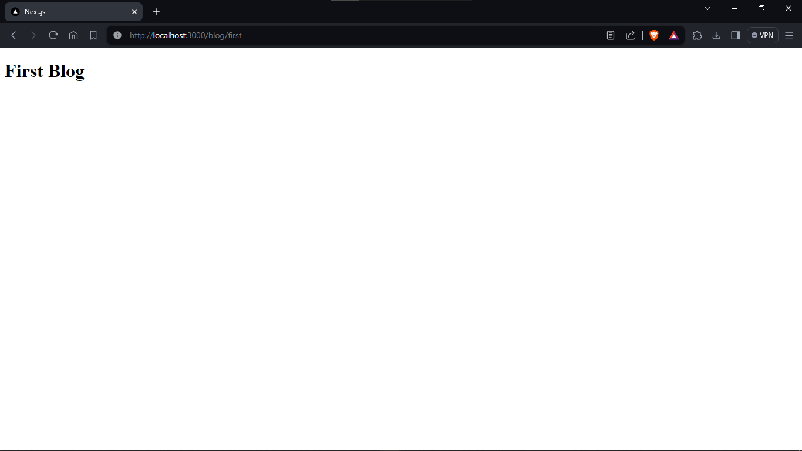

### Praktikum 2 Todo

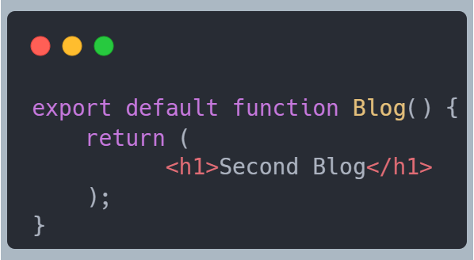

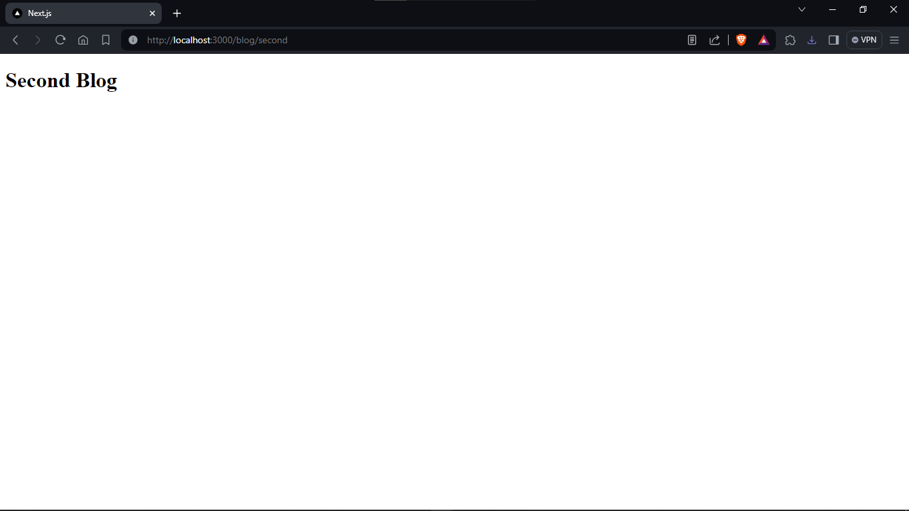

#### Apa kekurangan yang mungkin terjadi jika menggunakan pendekatan pada Praktikum 2 untuk menangani routing?

Perpindahan antar halaman masih manual, url statis dan belum dinamis.

#### Praktikum 3 Langkah 1

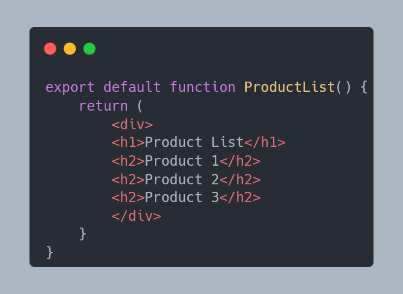

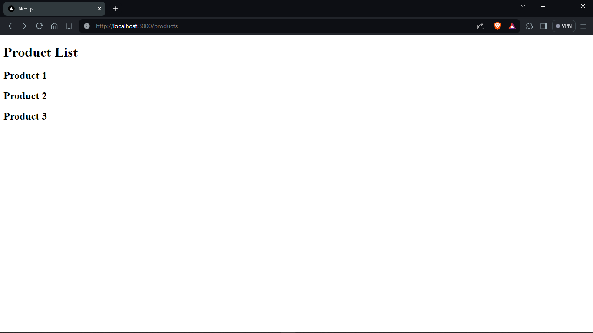

### Praktikum 3 Langkah 3

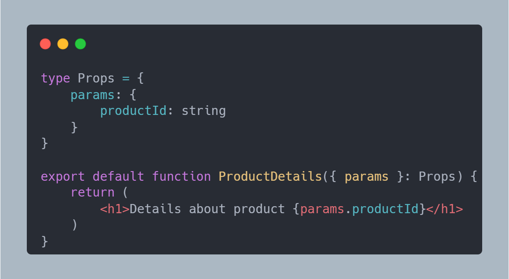

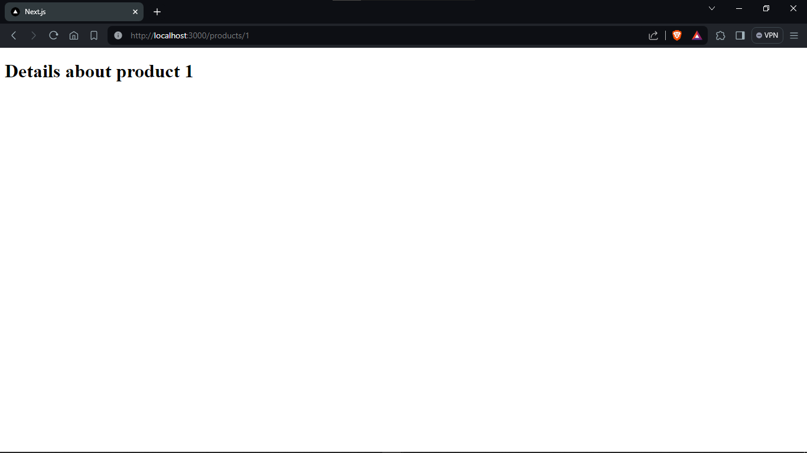

### Praktikum 3 Todo 1

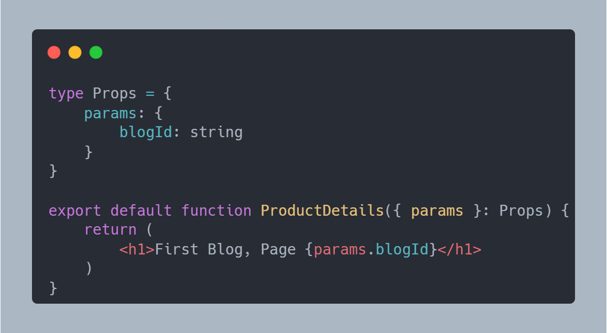

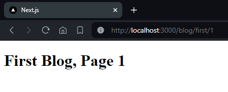

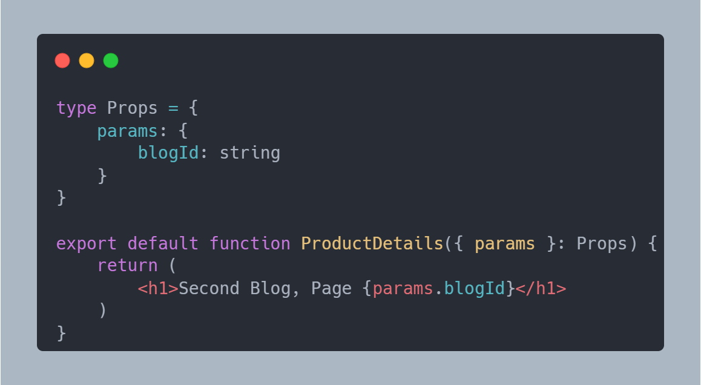

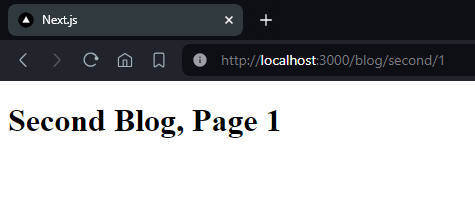

### Praktikum 3 Todo 2

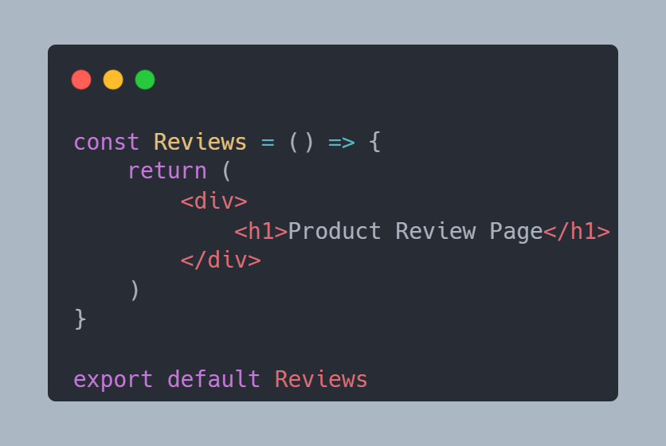

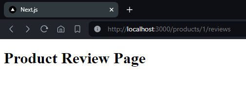

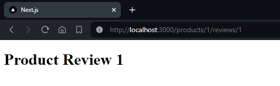