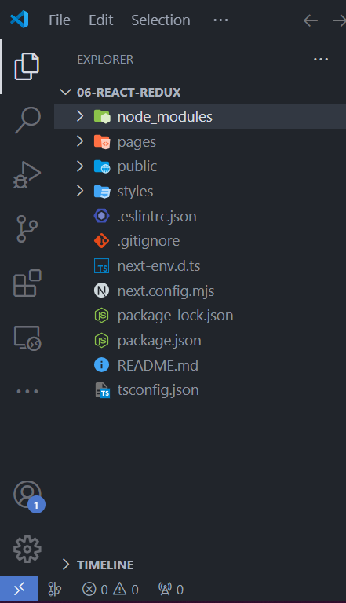
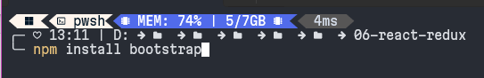
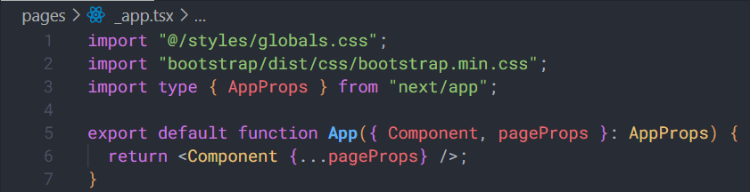
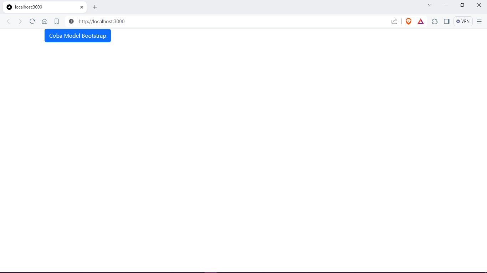
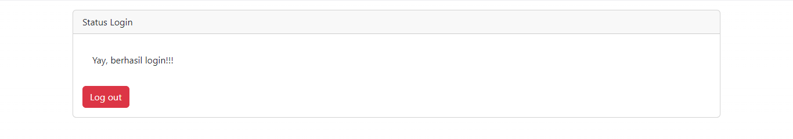
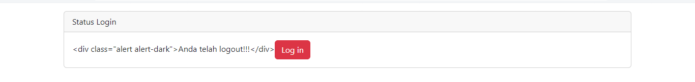

### NAMA: Patria Anggara Susilo Putra
### NIM: 2141720058
### KELAS: TI 3A
---

### Praktikum 1 Langkah 1: membuat proyek baru

### Praktikum 1 Langkah 2: menginstall bootstrap

### Praktikum 1 Langkah 3: menampilkan hasil run

### Praktikum 2 Soal

Keadaan ketika user mengklik tombol login

Keadaan ketika user mengklik tombol logout

Hasil ketika tidak menggunakan fungsi parse
