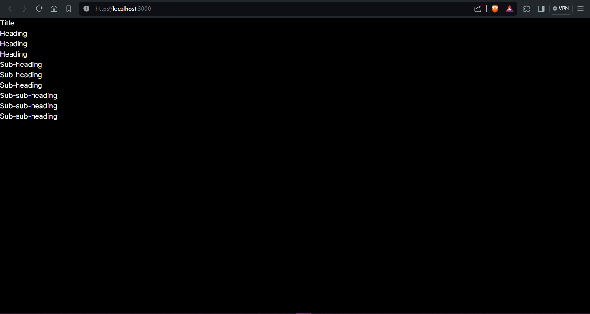
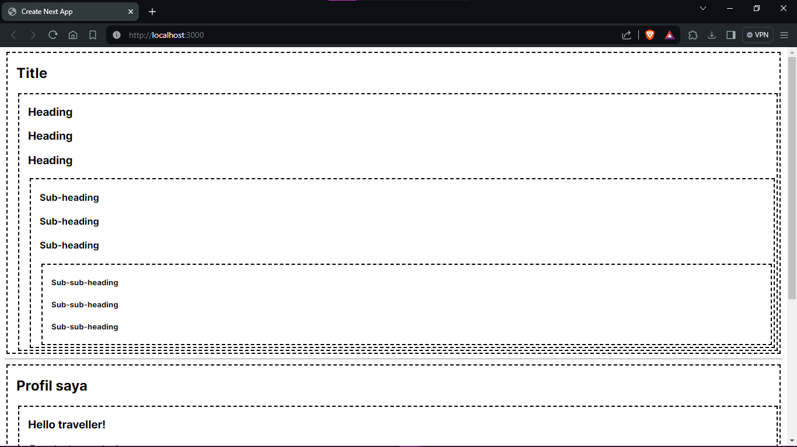
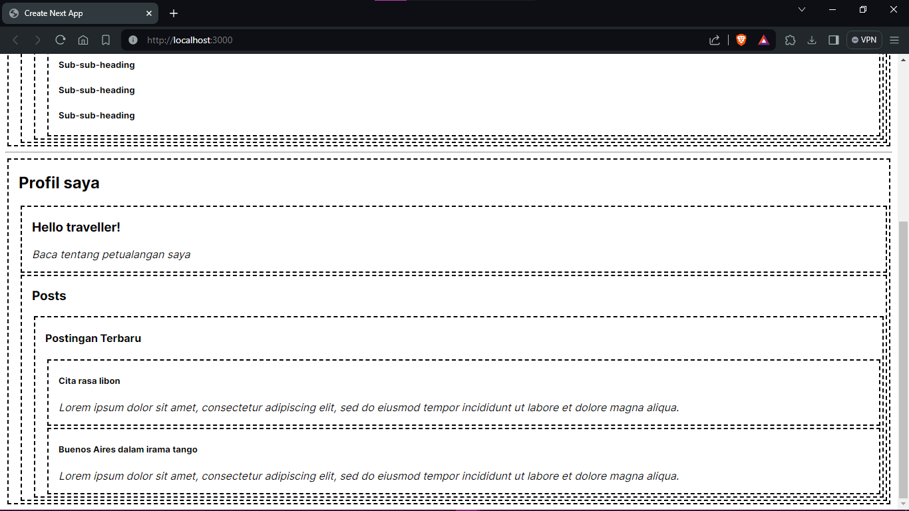
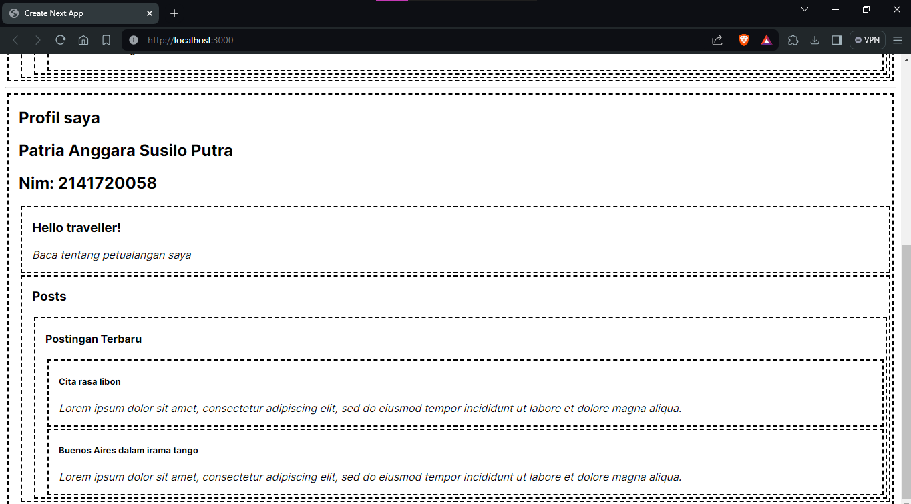
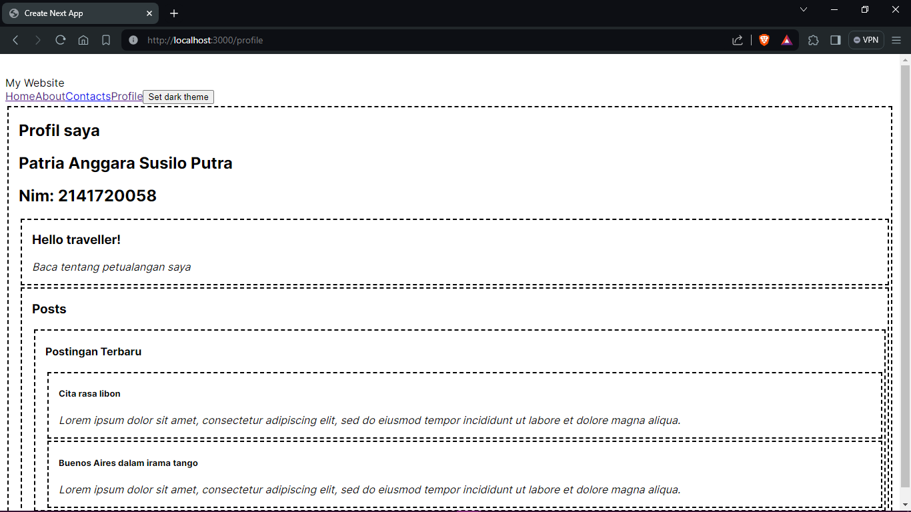
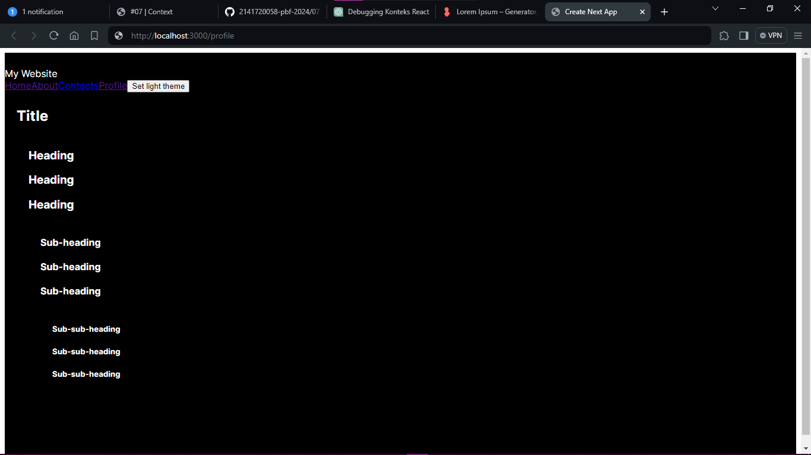

### Nama: Patria Anggara Susilo Putra
### Kelas: TI 3A
### NIM: 2141720058

---

#### Soal 1

Penjelasan: ukuran tiap teks sama, tidak ada perubahan sama sekali.

#### Soal 2

Penjelasan: ukurab teks masih belum berubah (ada kesalahan perubahan tidak terender ulang)  

#### Soal 3

Penjelasan: ukurab teks masih belum berubah (ada kesalahan perubahan tidak terender ulang)
Hal didapat, sebenarnya mengubah ukuran teks menggunakan variabel level dan context, teks berubah ukurannya sesuai dengan nilai level yang diberikan.

#### Soal 4

Menambahkan nama dan nim

#### Soal 5

