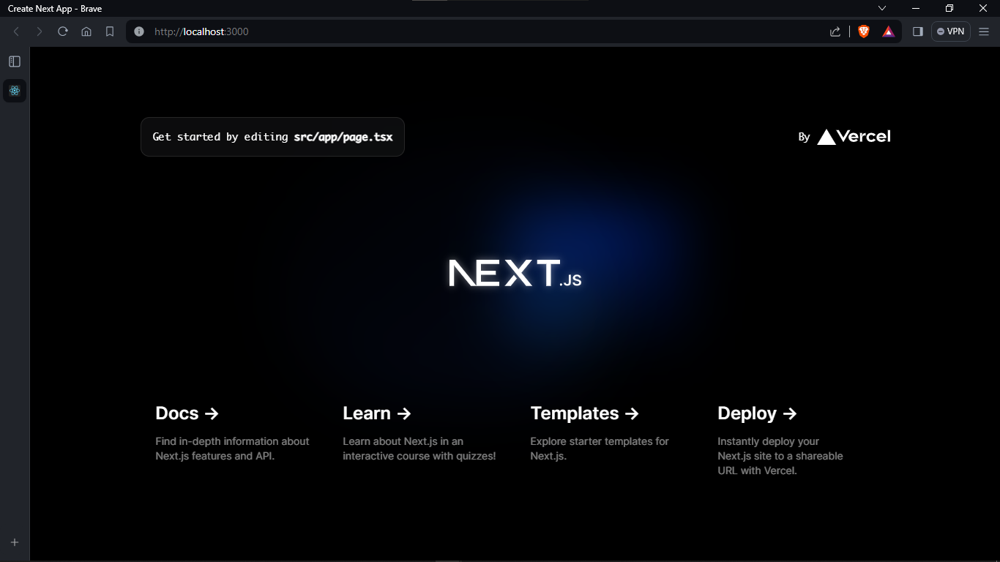

## Soal 1: Apa yang dimaksud dengan

1. Typescript, Bahasa pemrograman yang berbasis pada JavaScript, memiliki fitur strong-type dan konsep OOP. Typescript merupakan supertype dari JavaScript, artinya semua kode JavaScript juga merupakan kode Typescript.
2. ESLint merupakan sebuah tools untuk melakukan static analyzes code agar dapat mengetahui kode mana yang error dengan cepat. Dampaknya kode yang dibuat menjadi konsisten dan minim bug.
3. Tailwind CSS sebuah utility-first CSS Framework yang digunakan untuk membangun UI dengan cepat. utility-first ini artinya tailwind menyediakan banyak utility class yang digunakan untuk kustomisasi desain tanpa perlu membuat file css.
4. App Router memungkin untuk melakukan routing/perpindahan halaman dengan menggunakan folder hierarki sebagai segmen untuk url.
5. Import alias, sangat berguna untuk memberikan nama alias untuk file yang diimport. Contoh jika path file terlalu panjang, bisa menggunakan import alias agar lebih pendak dan bersih.

## Soal 2: jelaskan kegunaan folder dan file masing-masing tersebut!

Setelah berhasil membuat project Next.js, otomatis menambahkan tiga folder, yaitu .git, node_modules, public, dan src.

1. .git, folder ini berfungsi agar proyek kita dapat dihubungkan dengan repositori kita.
2. node_modules, sebagai pengelolaan dependensi pihak ketiga yang digunakan di dalam proyek.
3. public, digunakan untuk menyimpan file statis seperti gambar.
4. src, meyimpan semua file kode/halaman dari aplikasi dan file tersebut bisa digunakan untuk routing.

## Soal 3: Gantilah teks pada bagian atas dengan Nama - NIM Anda

## Perbedaan Next.js - Remix - Gatsby

### Next.js

Next.js menggunakan basis React yang memungkinkan untuk membangun aplikasi web dari sisi server side, ini memberikan manfaat seperti merender halaman di sisi server sebelum tiba di klien.

### Remix

Framework yang menyediakan berbagai fitur, termasuk server bawaan, pemisahan kode otomatis, chace sisi klien yang membuatnya mudah untuk membangun aplikasi web yang kompleks.

### Gatsby

Membangun aplikasi yang telah dioptimalkan untuk performa dan SEO, mampu mneghasilkan halaman statis sehingga menghasilkan waktu muat yang sangat cepat. Gatsby lebih susah untuk diatur dan dikonfigurasi dibandingkan dengan next.js dan remix

